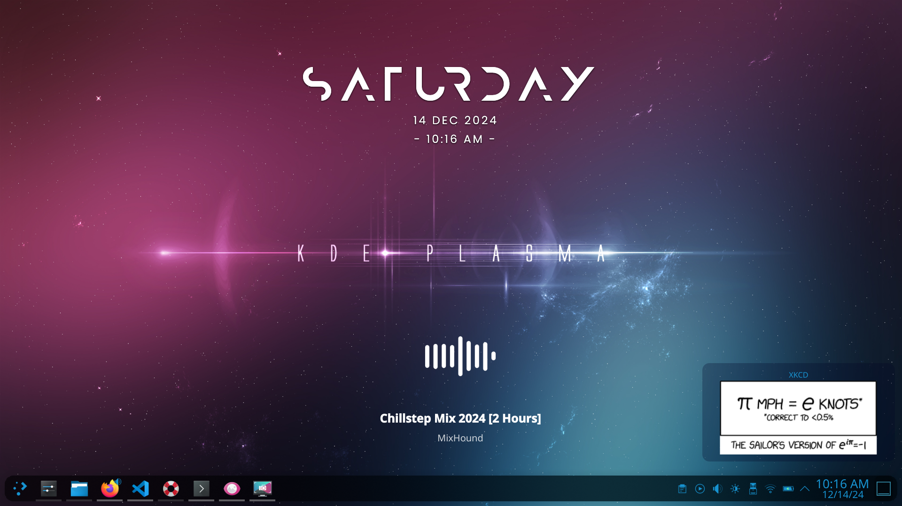
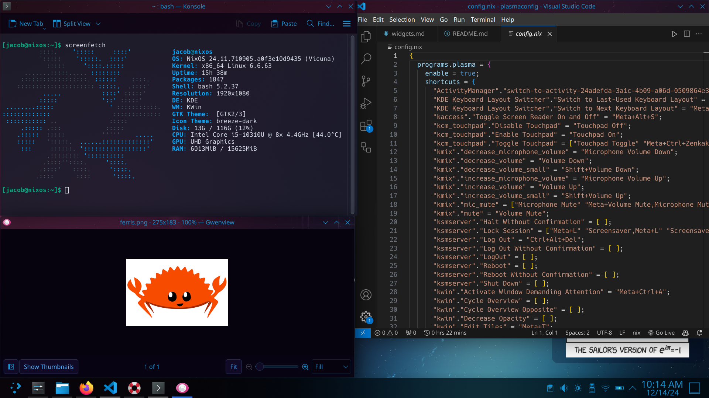

# NixOS rice with KDE Plasma 

#### intro
I made this rice for the hack club riceathon! This is a rice for my NixOS builds using the KDE window manager and KDE Plasma Dekstop. 
#### file structure
Config.nix contains all my customizations, generated with the [plasma-manager](https://github.com/nix-community/plasma-manager/tree/trunk) tool. In it contains all of my desktop configurations and settings. 

widgets.md is a short list of the widgets I used for the desktop screen, because I couldn't figure out how to store them in the config.nix file. 

